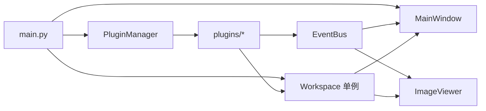

# 数字摄影测量实习平台 - 技术规格说明书

## 1. 目标与范围

本说明书定义项目的统一技术口径，覆盖以下内容：
- 核心架构与插件机制
- Workspace 数据结构
- EventBus 事件机制
- IPlugin 插件接口约束
- 主窗口与资源树的联动方式
- 模块目录规范与结果回写规范

本文档分为两层表述：
- 当前实现约束：当前代码必须遵守的规则
- 未来扩展预留：后续版本可演进的方向

## 2. 技术栈

### 2.1 当前实现约束
- Python 3.9+
- PySide6 作为 GUI 框架
- OpenCV 作为图像处理基础库
- NumPy 作为矩阵与数组计算基础
- SciPy / scikit-learn 作为算法辅助库
- 插件机制采用 `importlib + inspect` 的自定义反射式加载，不引入 Pluggy 作为第一版依赖

### 2.2 未来扩展预留
- GDAL / Rasterio 用于地理坐标栅格处理
- Open3D 用于点云与三维显示
- PyTorch 用于深度学习模块

## 3. 总体目录结构

```text
数字摄影测量实习平台/
├── main.py
├── core/
│   ├── base_interface.py
│   ├── event_bus.py
│   ├── log_manager.py
│   ├── plugin_manager.py
│   ├── project_manager.py
│   ├── task_engine.py
│   └── workspace.py
├── ui/
│   ├── main_window.py
│   ├── image_viewer.py
│   └── styles/
├── widgets/
├── plugins/
│   ├── mod1_image_process/
│   ├── mod2_aerial_tri/
│   ├── mod3_dsm_dem/
│   ├── mod4_dom/
│   ├── mod5_dlg/
│   ├── mod6_dl_interpret/
│   └── mod7_mipmap_3d/
└── workspace/
    └── data/
```

## 4. 总体架构

项目采用微内核 / 插件式架构。核心层只负责通用能力，业务算法全部放在插件中。



## 5. Workspace 规范

### 5.1 当前实现约束
Workspace 是全局共享数据中心，必须采用单例入口 `get_workspace()` 获取。

统一数据结构如下：

```python
{
    "project_path": None,
    "images": {},
    "processed_images": {},
    "point_clouds": {},
    "vectors": {},
    "masks": {},
    "dom": None,
    "dem": None,
    "models": {}
}
```

字段含义：
- `images`：原始影像池，字典结构，键为名称，值为 `{path, array}` 或兼容结构
- `processed_images`：处理结果统一入口，所有图像类算法结果默认写入这里
- `point_clouds`：点云资源池
- `vectors`：矢量资源池
- `masks`：掩膜资源池
- `dom` / `dem`：项目级成果引用位，不作为第一版默认写入入口
- `models`：模型或其它扩展资源

### 5.2 工作空间操作规范
- 读取原始图像时，优先从 `images` 取值
- 图像类处理结果统一通过 `add_processed_image()` 写入
- DOM / DEM 等项目级成果如果需要语义引用，可通过 `set_dom()` / `set_dem()` 保存引用位
- 清空工程时必须同时清理所有资源池与引用位

### 5.3 未来扩展预留
- 可增加更严格的资源对象类型
- 可为 `processed_images` 增加更多元信息，例如来源模块、参数快照、生成时间

## 6. EventBus 规范

### 6.1 当前实现约束
`core/event_bus.py` 是正式核心组件，必须提供单例 `get_event_bus()` 和主题枚举 `EventTopics`。

必须至少支持以下主题：
- `TOPIC_IMAGE_ADDED`
- `TOPIC_IMAGE_SELECTED`
- `TOPIC_IMAGE_UPDATED`

职责划分：
- 主窗口监听 `TOPIC_IMAGE_ADDED` 和 `TOPIC_IMAGE_UPDATED`，刷新资源树
- ImageViewer 监听图像选择和图像更新事件，刷新中央视图
- 插件在处理完成后发布 `TOPIC_IMAGE_UPDATED`

### 6.2 未来扩展预留
- 可扩展任务进度、项目保存、项目加载等主题
- 可扩展更细粒度的数据变更事件

## 7. 插件接口规范

### 7.1 当前实现约束
所有插件必须继承 `core.base_interface.IPlugin`。

必须实现的方法：
- `plugin_info()`
- `get_ui_panel()`
- `execute()`

建议契约：
- `execute()` 负责流程编排，不直接依赖外层调用者传入复杂状态
- 输入默认从 `self.workspace` 读取
- 图像结果统一通过 Workspace 回写
- 返回值建议为 `bool` 或结构化状态对象，例如：

```python
{"success": True, "message": "ok", "result_name": "DOM_20260406_120000"}
```

### 7.2 未来扩展预留
- 可为 `execute()` 增加统一返回模型
- 可为插件增加启停生命周期钩子

## 8. 插件加载机制

### 8.1 当前实现约束
插件加载采用自定义反射加载：
- 扫描 `plugins/` 下的子目录
- 导入 `plugins.<module>` 或 `plugins.<module>.plugin`
- 查找继承 `IPlugin` 的类并实例化

这是正式口径，当前版本不引入 Pluggy 作为强制机制。

### 8.2 未来扩展预留
- 若后续需要更复杂的 hook 管理，再评估是否引入第三方插件框架

## 9. 主窗口与资源树

### 9.1 当前实现约束
资源树字段映射固定为：

| Workspace 字段 | 资源树显示 |
|---|---|
| `images` | 原始影像 |
| `processed_images` | 处理结果 |
| `point_clouds` | 点云 |
| `vectors` | 矢量 |
| `masks` | 掩膜 |
| `dom` / `dem` | 项目成果引用 |

主窗口职责：
- 接收插件注册结果并生成菜单
- 监听事件总线，刷新资源树与视图
- 管理工具面板切换

### 9.2 未来扩展预留
- 可为资源树增加更多分类节点，例如模型、工程附件、日志快照

## 10. 模块目录规范

### 10.1 当前实现约束
每个插件模块至少应包含：
- `__init__.py`
- `plugin.py`
- `ui.py`

可选目录：
- `algorithms/`
- `models/`
- `docs/`

### 10.2 未来扩展预留
- 如模块复杂，可继续拆分为更细粒度的算法文件，但对外接口必须保持稳定

## 11. 输出与保存规范

### 11.1 当前实现约束
图像类模块结果：
- 默认保存为处理结果池中的一项
- 默认通过 `_update_workspace_image()` 模板写回
- 默认发布 `TOPIC_IMAGE_UPDATED`

保存路径要求：
- Windows 中文路径必须使用兼容写法
- 写文件优先使用 `cv2.imencode(...).tofile(...)` 或等价兼容方案

### 11.2 未来扩展预留
- DOM / DEM 结果可进一步导出为 GeoTIFF 或其它地理栅格格式

## 12. 结论

本项目第一版的正式技术口径如下：
- 使用单例 Workspace
- 使用字典式资源池
- 使用 `processed_images` 作为图像类结果统一入口
- 使用 EventBus 驱动界面刷新
- 使用自定义反射式插件加载
- 使用 `IPlugin` 作为唯一插件接口

后续所有模块开发与文档编写都应以本规范为准。
