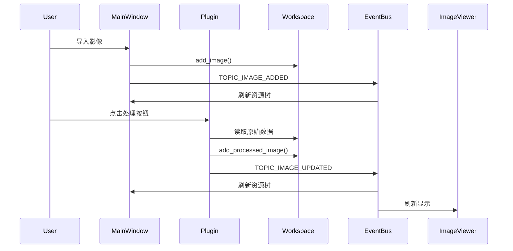

# 数字摄影测量实习平台 - 整体架构设计

## 1. 架构总览

本项目采用微内核 / 插件式架构。核心层负责通用能力，所有业务功能放入独立插件模块。

### 当前实现约束
- 核心层只保留框架能力，不承载具体业务算法
- 插件通过 `IPlugin` 接口统一接入
- 插件加载采用 `importlib + inspect` 的反射式扫描
- Workspace 使用单例
- EventBus 负责跨模块通信

### 未来扩展预留
- 如后续模块复杂度增加，可再引入更严格的插件生命周期管理
- 可扩展地理参考、点云、深度学习推理等重型能力

## 2. 核心层职责

核心层由 `core/` 与 `ui/` 中的通用组件组成。

### 2.1 core 层
- `workspace.py`：全局数据中心，存储原始影像、处理结果、点云、矢量、掩膜、成果引用位
- `event_bus.py`：事件总线，负责跨组件发布与订阅
- `plugin_manager.py`：插件扫描、导入和实例化
- `base_interface.py`：插件接口约束
- `project_manager.py`：项目保存与加载
- `task_engine.py`：异步任务与进度管理

### 2.2 ui 层
- `main_window.py`：主窗口、菜单、工具栏、资源树、状态栏
- `image_viewer.py`：二维影像查看与交互
- `styles/`：主题样式

## 3. 插件层职责

插件层位于 `plugins/`，每个目录对应一个独立模块。

### 当前实现约束
每个插件模块至少要有：
- `__init__.py`
- `plugin.py`
- `ui.py`

复杂模块可以额外包含：
- `algorithms/`
- `models/`
- `docs/`

### 插件职责边界
- UI 负责参数输入、状态显示和按钮触发
- 算法层负责具体处理逻辑
- 插件入口负责编排流程、读取 workspace、写回结果、发布事件

## 4. 关键数据流

## 5. 核心组件交互规则

### 5.1 Workspace
- 作为唯一共享数据中心
- 所有模块从这里读数据、向这里写结果
- 原始影像与处理结果分开管理
- `processed_images` 是当前版本所有图像处理输出的统一入口
- `dom` / `dem` 仅作为项目级语义引用位

### 5.2 EventBus
- 用于解耦插件与主窗口、视图组件
- 插件处理完成后发布结果更新事件
- 主窗口只订阅，不反向依赖插件内部实现

### 5.3 PluginManager
- 负责扫描 `plugins/` 目录
- 加载继承 `IPlugin` 的类
- 实例化时注入同一个 Workspace 单例
- 维护插件列表，供主窗口注册菜单与工具面板

### 5.4 MainWindow
- 负责菜单生成、资源树展示、工具面板挂载、状态提示
- 负责订阅数据更新事件
- 负责把插件 UI 统一加入右侧工具区

## 6. 插件加载流程

### 当前实现约束
1. `main.py` 启动应用
2. `get_workspace()` 初始化或获取全局工作空间
3. `MainWindow` 创建主界面
4. `PluginManager.discover_plugins()` 扫描插件目录
5. 对每个插件调用 `register_plugin()`
6. 菜单和工具面板自动出现在主界面

### 未来扩展预留
- 可增加插件启用/禁用配置
- 可增加按分组延迟加载机制

## 7. 资源树映射

资源树与 Workspace 字段的固定映射如下：

| Workspace 字段 | 显示名称 | 说明 |
|---|---|---|
| `images` | 原始影像 | 导入的源图像 |
| `processed_images` | 处理结果 | 所有图像类模块输出 |
| `point_clouds` | 点云 | 三维点云资源 |
| `vectors` | 矢量 | 线、面、边界等 |
| `masks` | 掩膜 | 分割与遮罩数据 |
| `dom` / `dem` | 项目成果引用 | DOM / DEM 语义引用位 |

### 当前实现约束
- 资源树刷新由 `TOPIC_IMAGE_ADDED` / `TOPIC_IMAGE_UPDATED` 驱动
- 原始影像与处理结果应清晰分层
- 不要让不同模块各自创造新的资源树分类规则

## 8. 模块分类

### 8.1 当前模块划分
- 模块一：基础影像处理
- 模块二：空中三角测量
- 模块三：DSM / DEM 生产
- 模块四：DOM 生产
- 模块五：DLG
- 模块六：深度学习解译
- 模块七：MipMap 三维重建

### 8.2 设计原则
- 模块之间不直接耦合
- 通过 Workspace 传递数据
- 通过 EventBus 触发 UI 更新
- 通过 IPlugin 统一入口

## 9. 当前实现约束与未来扩展

### 当前实现约束
- 插件加载采用反射式加载，不使用 Pluggy 作为第一版强制框架
- Workspace 采用字典式资源池
- 图像类结果统一写入 `processed_images`
- DOM / DEM 作为引用位保留，不取代统一结果池

### 未来扩展预留
- 可加入更严格的插件元数据校验
- 可将 DOM / DEM 变成更完整的项目级成果对象
- 可为不同数据类型补充更细的专用视图

## 10. 推荐开发顺序

1. 先完成核心接口与数据流统一
2. 再完善各模块算法
3. 最后补强导出、预览与高级地理处理

## 11. 架构结论

如果只保留一句话来概括本项目架构，那就是：

> 核心层管框架，插件层管业务，Workspace 管数据，EventBus 管刷新。

这也是后续所有文档和代码必须遵守的总原则。
